# Title: UNIMEAL

__Group Members:__
1. __AHMAD ADAM DANIAL BIN AB RAHMAN__ and __2319525__
2. __TENGKU MUHAMMAD ABDUH BIN TENGKU MOHAMAD ZULKIFLI__ and __2219029__
3. __MUHAMMAD MUIZZUDDIN BIN AMIN__ and __2220323__
4. __NURFARAH HANIS BINTI ISMAIL__ and __2226488__
5. __NUR SAFIAH ASHIQIN BINTI SHUHANIZAL__ and __2317618__

## 1.0 Introduction

Food service is one of the important criteria for having a comfortable life as a university student. Throughout the time, the increasing number of students in IIUM had addressed the new problem of the efficiency and services of cafeteria food on the campus. Therefore, UniMeal is introduced to solve this problem. A redesigned web application called UniMeal gathers student orders for food and displays the menus from several cafeterias around IIUM. The main target audience of this web application is IIUM students and also the Mahallah Cafeteria. Students will have better food services to buy food, and the Mahallah Cafeteria will also get the benefit of having a lot of online orders. UniMeal's main goal is to give students access to online apps that will enhance the effectiveness of food services at IIUM in the future.

## 2.0 Objectives
The primary objective of the UniMeal is:
- To provide wide-range of food selection to IIUM student within one centralised platform
- To enhance order efficiency and convenience for food ordering around IIUM.
- To support IIUM community and collaboration on promoting student-run cafeteria on campus.
- To support the student in effectively managing their food expenses.

## 3.0 Features and Functionalities
The UniMeal web application aims to deliver an efficient, user-friendly, and centralized platform for food ordering across IIUM campus cafeterias. The key features and functionalities are as follows:

1. User Registration and Login
   - Secure user authentication system for students and cafeteria vendors.
   - User roles: Student (customer) and Vendor (cafeteria admin).

2. Cafeteria and Menu Browsing
   - Browse and view a list of all available cafeterias within the IIUM campus.
   - Access to daily menus, prices, food images, and descriptions.

3. Food Ordering System
   - Add items to the cart and place food orders directly from the selected cafeteria.
   - Real-time availability and estimated preparation time display.

4. Payment Integration
   - Multiple payment options: cash on pickup, online banking, or e-wallet integration.
   - Order receipt generation for records.

5. Order Tracking
   - Live status updates: Order placed → Preparing → Ready for pickup..

6) Cafeteria Dashboard (Vendor Panel)
   - Cafeteria vendors can manage their menus and receive orders.

7) Responsive Design
   - Optimised for desktop for easy access on a laptop.

## 4.0 Entity Relationship Diagram (ERD)

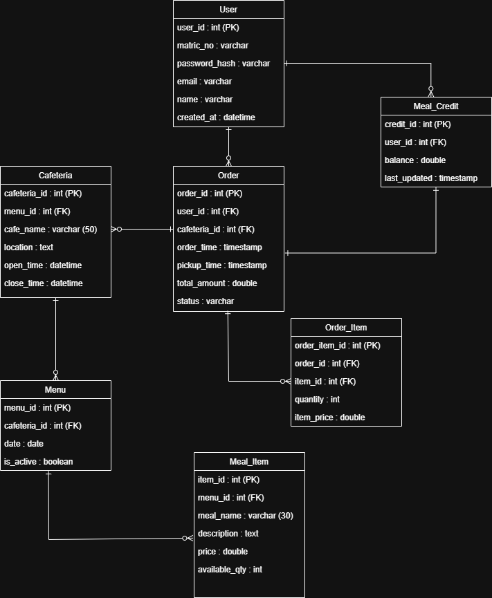

## 5.0 Sequence Diagram 
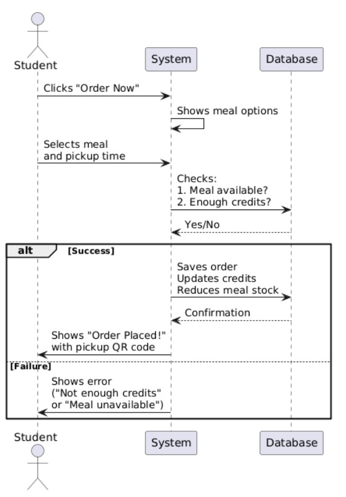

## 6.0 Mockup (Figma link : https://www.figma.com/design/0xzzvD9iEsLNKpqIGoBAka/UNIMEAL?node-id=210-2&t=xwdXG33riCfDR0uM-1)
### Registration Page
#### Student Registration Page

#### Vendor Registration Page

### Login page
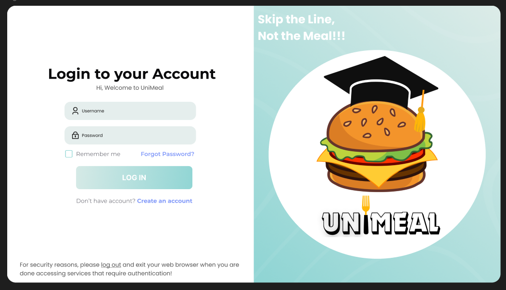

### Homepage
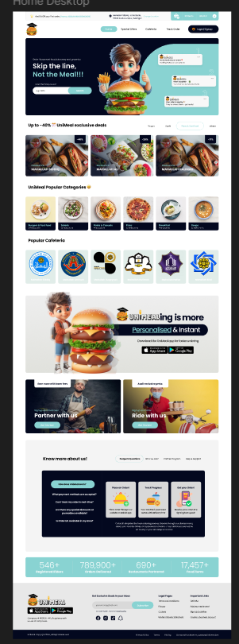

### Vendor Dashboard Page

### Food Selection Page

### Place Order Page

### Shipping Details Page
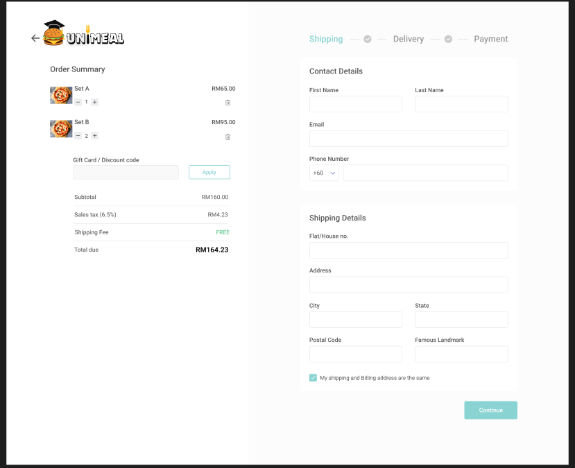

### Delivery Option Page
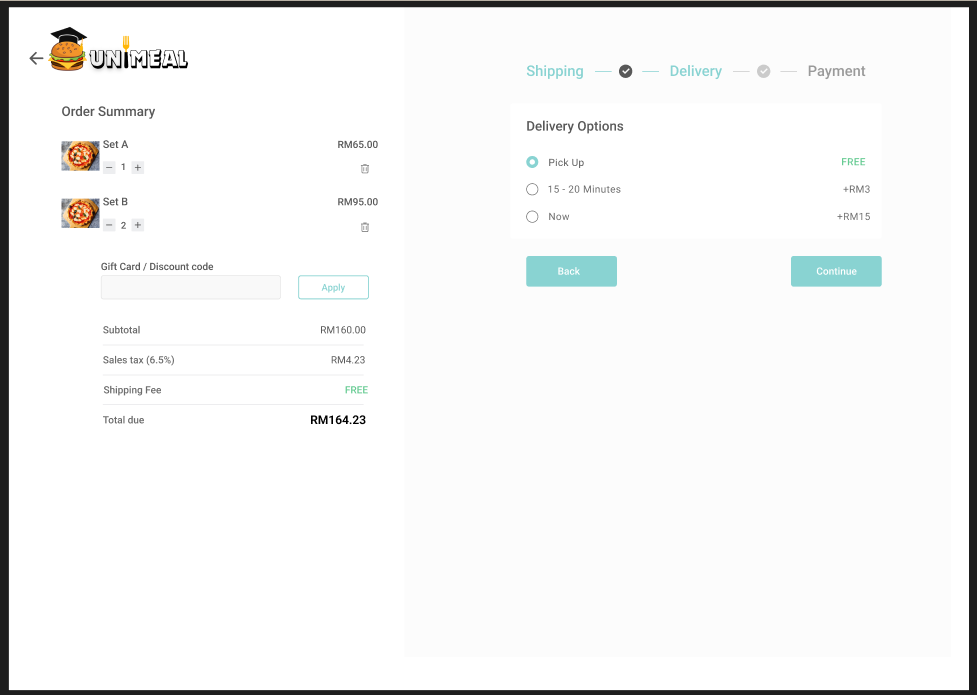

### Payment Method Page

### Track Order Page

## 7.0 References

Athuraliya, A., & Creately. (2022, December 12). Sequence Diagram Tutorial – Complete Guide with Examples. Creately. https://creately.com/guides/sequence-diagram-tutorial/

WhatisSequenceDiagram?(n.d.).https://www.visual-paradigm.com/guide/uml-unified-modeling-language/what-is-sequence-diagram/

  
 

# FINAL REPORT

## 8.0 Project system captured screen and explaination

### Login page

This screenshot captures the Login Page for the UNIMEAL web application. It serves as the primary gateway for existing users to access their accounts. The page is cleanly divided into two main sections:

1. __The Login Form__
   
   On your left is the login form, this is the functional part of the page, designed for user interaction:
   - __Credentials Input__: Standard fields are provided for the user to enter their email and password. The password field correctly masks the input for security.
   - __Convenience Features__: A "Remember me" checkbox is available to keep the user logged in, and a "Forgot Password?" link provides a way to recover a lost account.
   - __Primary Action__: The large pink "LOG IN" button is the main call-to-action for users to submit their credentials.
   - __User Role Distinction__: Crucially, the page provides two distinct paths for new users:
         - __Create an account__: This is for the primary user type, likely the students.
         - __Register as Vendor__: This separate button indicates that the system supports multiple user roles, allowing cafeteria owners (vendors) to register and access a different part                                     of the application (like their dashboard).

2. __Branding and Value Proposition__
   
   On the right is the brand and value proposition, this section communicates the application's identity and purpose:
     - __Slogan__: The catchy tagline, "Skip the Line, Not the Meal!!!", clearly and effectively communicates the core benefit of using UNIMEAL—convenience and time-saving.
     - __Logo__: The creative logo, featuring a burger wearing a graduation cap, cleverly targets its university student audience while representing its food-service nature.
     
     
### Registration Page
#### Student Registration Page
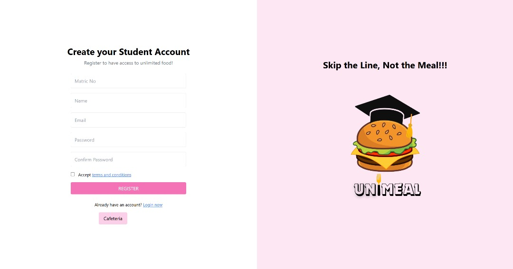

This screenshot shows the Student Registration Page for the UNIMEAL application. It is the entry point for new students who want to create an account. The page maintains a consistent two-column layout, similar to the login screen:

1. __The Registration Form__

   On the left side, the form is designed to collect the essential information needed to create a student      account:

     -  __Header__: It is clearly labeled "Create your Student Account" to avoid any confusion.
     -  __Input Fields__: The form requests specific details from the student:
           -  __Student/Matric Number__ : This unique identifier is crucial for verifying the user as a student within the university system.
           -  __Name__: A standard field for the user's name or username.
           -  __Email Address__: Used for account verification, login, and receiving notifications.
           -  __Password and Password Confirmation__: Two fields for the password ensure the user enters their intended password correctly, reducing errors.
           -  __Terms and Conditions__: An "Accept terms and conditions" checkbox is included, which is a standard practice for legal compliance and user agreement.
           -  __Primary Action__: A prominent pink "REGISTER" button prompts the user to complete the process.
   
2. __Branding and Value Proposition__
   
   On the right is the brand and value proposition, this section communicates the application's identity and purpose:
     - __Slogan__: The tagline "Skip the Line, Not the Meal!!!" is displayed again, connecting the registration process with the core benefit of the app.
     - __Logo__: The UNIMEAL logo with the graduation-cap-wearing burger is present, maintaining visual consistency and appeal to the target audience.

#### Vendor Registration Page
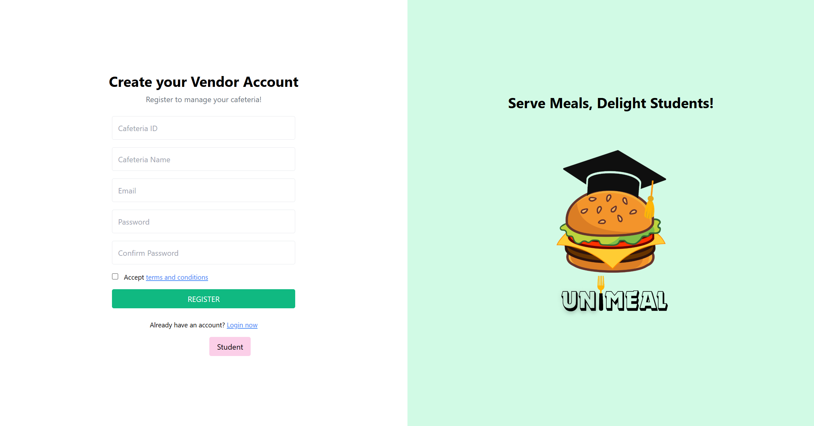

This screenshot displays the Vendor Registration Page for the UNIMEAL platform. This is a dedicated portal for cafeteria owners or managers to create their business accounts, separate from the student users.

1.**Key Features and Design**:
   - **Clear and Focused Title**: The heading "Register as Vendor" immediately informs the user about the page's purpose, ensuring that cafeteria owners are on the correct registration path.
   - **Essential Information Fields**: The form is streamlined to collect only the necessary details for a vendor account:
      - **Name**: This field is intended for the name of the cafeteria itself (e.g., "Mahallah Aminah"), which will be displayed to students on the platform.
      - **Email**: The primary contact and login credential for the vendor.
      - **Password**: Standard fields for secure account creation.

### Cafeteria & Menu Browsing Page

This composite image shows the Student Homepage / Dashboard of the UNIMEAL application, which is the main landing page a student sees after successfully logging in. It's designed to be a central hub for navigating the app's features.

1. __The Welcome and Promotion Section__
   This is the "above the fold" content, designed to welcome the user and present key information immediately.

   - __Personalized Header__: A warm greeting, "Welcome to UniMeal, Abduh," personalizes the experience and confirms the user is logged in. Essential action buttons, "Track My Orders" and "Logout," are prominently displayed for easy access.
   - __Hero Section__: This visually engaging area uses a large graphic and bold text to communicate the app's value proposition:
      - "UNIMEALING is more Personalised & Instant."
      - It also includes a call-to-action to download a mobile app from the App Store and Google Play, suggesting a broader ecosystem beyond the web application. The arrows on the sides indicate this might be a rotating carousel for promotions or features.

2. __Food and Cafeteria Selection__
   This section provides the core functionality, allowing the user to begin the ordering process.
   - __UniMeal Popular Categories__: This feature helps with food discovery by showcasing popular food types like Drinks, Pizza, Mee, Nasi, and Soup. It allows users to browse by food preference first, rather than by cafeteria, offering a flexible way to find what they want to eat.
   - __Select Your Mahallah Cafeteria__: This is the primary navigation hub of the application. It presents a clear, grid-based list of available cafeterias on campus such as Siddiq Cafeteria, Aminah Cafeteria, Ruqayyah Cafeteria and many more. Each cafeteria is represented by its official logo and name, making it easy for students to recognize and select their desired dining location to start ordering.

### Vendor Dashboard Page
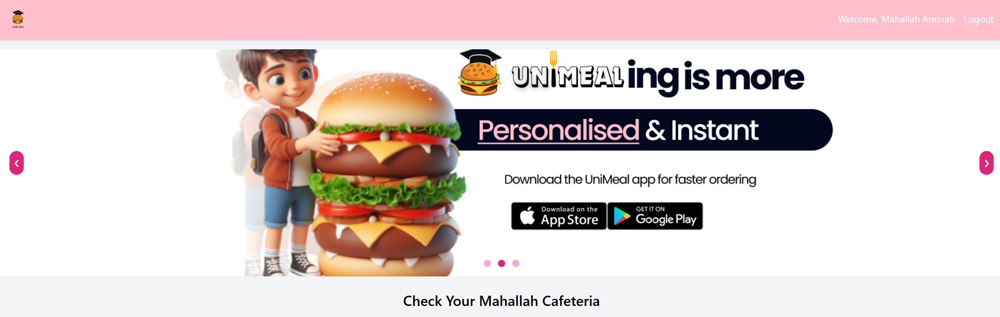

The screenshot of Vendor Dashboard Page serves as the central hub for vendors registered in the UniMeal system. It is designed to provide quick access to key tools and information relevant to managing their food service operations within the platform.

1. **Key Components of the Page**:
- **Welcome Banner**:
   - Displays a visually engaging banner promoting the UniMeal platform.
   - Highlights app availability on Google Play and App Store.
   - Branding slogan “UniMeal-ing is more” with a focus on personalized and instant service.
   - Targeted toward vendors to encourage participation and usage of the system.

- **User Greeting & Logout**:
   - Shows a personalized welcome message with the vendor's name (e.g., “Welcome, Mahallah Ameenah”).
   - Logout option for secure session management.

- **Future Functionalities (to be included)**:
   -Menu management (add/edit/delete food items)
   - Order tracking and status updates
   - Sales analytics and performance metrics
   - Notifications and announcements
   - Access to customer feedback or reviews

### Food Ordering System Page
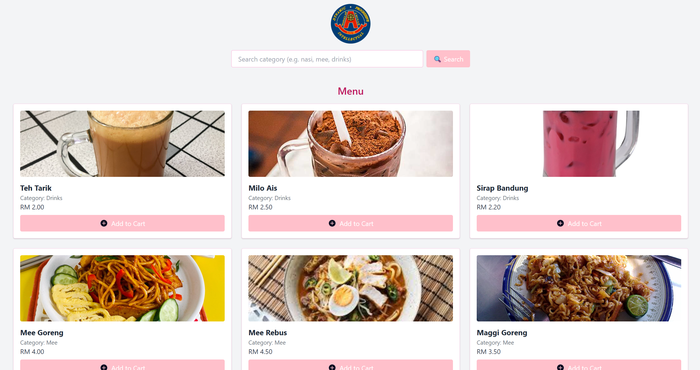
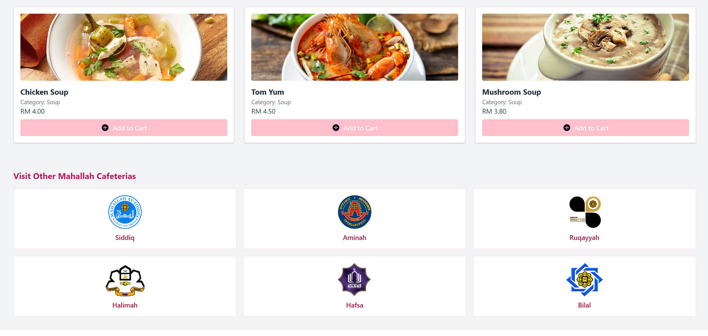

This composite screenshot shows the Cafeteria Menu Page for "Aminah Cafeteria" within the UNIMEAL application. This is the central interface where a student browses the available food and drink items from a specific vendor and adds them to their order. 

1. **Key Components of the Page**:
   - **Header and Navigation**:
      - The page has a clear header that displays the name of the selected cafeteria, "Aminah Cafeteria," so the user knows exactly where they are ordering from.
      - It includes essential navigation buttons: a "Back to Home" link to return to the main dashboard and a "View Cart" button to proceed to the next step of the ordering process.

   - **Search Functionality**:
      - A prominent search bar is provided to help users quickly find specific items. The placeholder text, "Search category (e.g., nasi, mee, drinks)", guides the user on how to filter the menu effectively, which is particularly useful for cafeterias with extensive offerings.

   - **The Menu Display**:
      - The core of the page is the Menu, presented in a clean, visually-driven, card-based grid layout.
      - Each card represents a single menu item and contains all the necessary information for the user to make a decision:
         - **Food Image**: A clear, appealing picture of the dish or drink.
         - **Item Name**: The name of the food (e.g., Teh Tarik, Mee Goreng, Nasi Lemak).
         - **Category**: Helps organize the menu and provides context (e.g., Drinks, Mee, Nasi).
         - **Price**: Clearly displayed in Malaysian Ringgit (RM).
         - **Add to Cart Button**: A simple, one-click action for the user to add the item to their order.
     

### Payment Integration Page
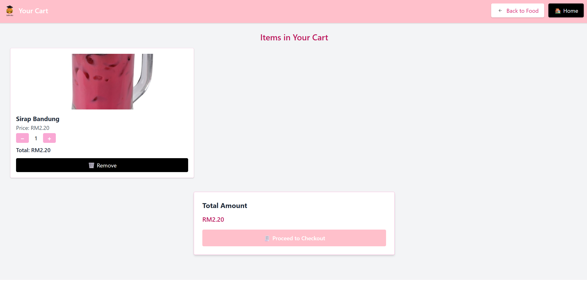
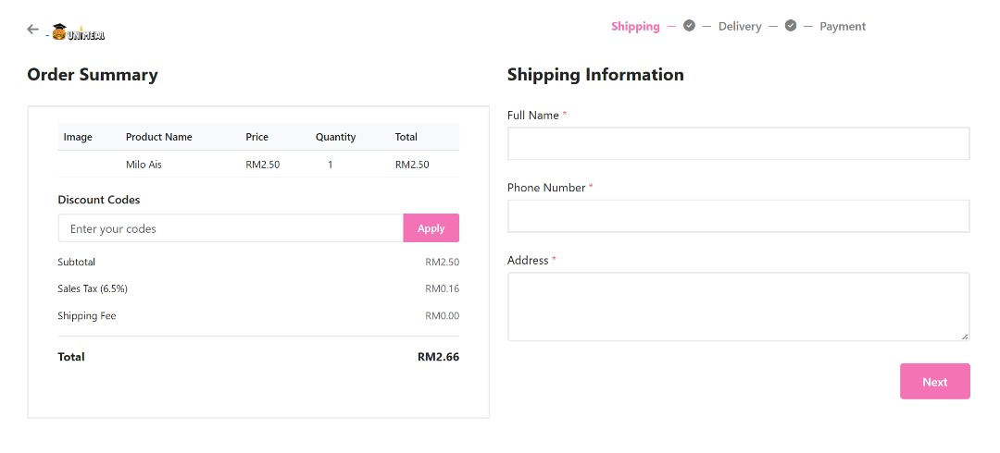
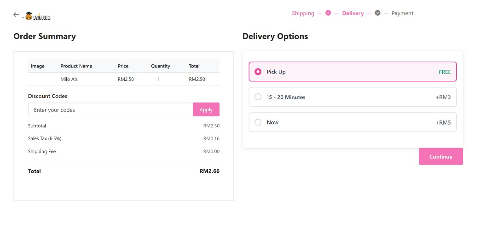
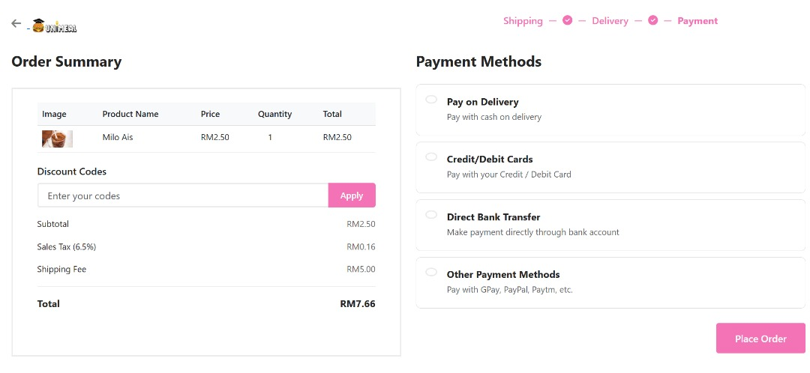

This series of screenshots captures the entire checkout and ordering process for the UNIMEAL application. It's a well-structured, multi-step flow that guides the user from their shopping cart to a final order confirmation.

1. __The Shopping Cart__

   This is the first step where the user reviews their selections.
      - __Item Review__: The user can see the items they've added ("Milo Ais"), along with the price and a picture.
      - __Quantity Control__: Users can adjust the quantity of an item or remove it entirely.
      - __Order Summary__: A clear "Total Amount" is displayed.
      - __Call to Action__: The "Proceed to Checkout" button moves the user to the next stage.
     
3. __Checkout - Shipping Information__

   This is the first page of the formal checkout process.
      - __Progress Tracker__: A visual tracker ("Shipping — Delivery — Payment") shows the user their current stage and what's next.
      - __Persistent Order Summary__: A detailed summary is fixed on the left, showing the itemized list, subtotal, taxes, and any fees. This summary updates dynamically as the user makes selections. It also includes a field for Discount Codes.
      - __Information Form__: The main section on the right asks for the user's Shipping Information (name, phone number, address).

4. __Checkout - Delivery Options__

   After providing their details, the user selects how they want to receive their order.
     - __Progress Update__: The tracker now highlights "Delivery."
     - __Choice of Options__: The user is presented with multiple Delivery Options, each with a different timeframe and associated cost. For example, "Pick Up" is free, while faster delivery options have an added fee).
     - __Dynamic Cost__: Selecting an option with a fee will update the "Shipping Fee" and "Total" in the order summary.
       
5. **Checkout - Payment Method** 

   This is the final step before confirming the order.
     - **Progress Update**: The tracker highlights "Payment."
     - **Updated Order Summary**: The total on the left now reflects the delivery fee chosen in the previous step (Total is now RM7.66).
     - **Payment Selection**: The user can choose from various Payment Methods, such as "Pay on Delivery," "Credit/Debit Cards," or "Direct Bank Transfer."
     - **Final Action**: The "Place Order" button submits the order for processing.

6. **Order Confirmation / Receipt**
     - This final screen confirms that the order was successful.
     - **Confirmation Message**: A clear "Order Confirmed!" message assures the user their order has been received.
     - **Complete Order Details**: It provides a comprehensive receipt, including:
        - Order ID and Status ("Pending").
        - The selected Delivery and Payment methods.
        - The user's Shipping Information.
        - An itemized list of what was ordered.
        - A final, detailed cost summary.

### Order Tracking Page

This screenshot displays the Order History page of the UNIMEAL application. This is where a user can view and track all of their past and current orders. 

- **Key Features of the Page**: Centralized Order List: The page presents a clear, chronological list of all orders placed by the user (e.g., "Order #2", "Order #1"). Each order is contained within its own distinct card, making the information easy to read and differentiate.

- **At-a-Glance Order Summary**: Each order card provides a concise summary of the most important details:
   - **Order Number**: A unique identifier for the transaction.
   - **Total Cost**: The final price paid for the order.
   - **Date and Time**: When the order was placed.
   - **Delivery and Payment Method**: Confirms how the order will be received and was paid for (e.g., "Delivery: Pick Up," "Payment: Cash").

- **Visual Status Tracker**:
   - The most prominent feature is the graphical progress bar that visually tracks the status of each order.
   - It shows three key stages: Confirmed → In Progress → Delivered.
   - The current stage is highlighted (in pink), while future stages are greyed out. This allows the user to instantly understand the live status of their order without having to read through text. In this example, both orders are "Confirmed" but have not yet moved to the "In Progress" stage.

## 9.0 What is the challenge/difficulties to develop the application

1. __System Integration Challenges__
      - Multiple user roles (student, vendor, admin) require separate dashboards and permissions.
      - Synchronizing modules (e.g. order → shipping → payment) needs careful planning to avoid data                mismatches or delays.
        
2. __Backend & Database Complexity__
      - Ensuring relational database structure is normalized and scalable.
      - Preventing data redundancy and maintaining consistency across modules.
        
3. __Security & Authentication__
      - Ensuring secure login/registration (especially for payment-related pages).
        
4. __User Interface & Experience (UI/UX)__
      - Making sure the UI is responsive across devices.
      - Ensuring the checkout flow is smooth (especially for payment).
      - Preventing user drop-off due to confusing layouts or form overload.
        
5. __Testing & Bug Fixing__
      - Testing all edge cases.
      - Ensuring form validations work as expected.
      - Testing across browsers and devices for layout consistency.
        
6. __Team Collaboration & Coordination__
      - Merging code and avoiding Git conflicts when multiple people are working simultaneously.
        
7. __Time & Resource Constraints__
      - Limited time to finish features for each team member.
      - Balancing between design, coding, and testing phases

